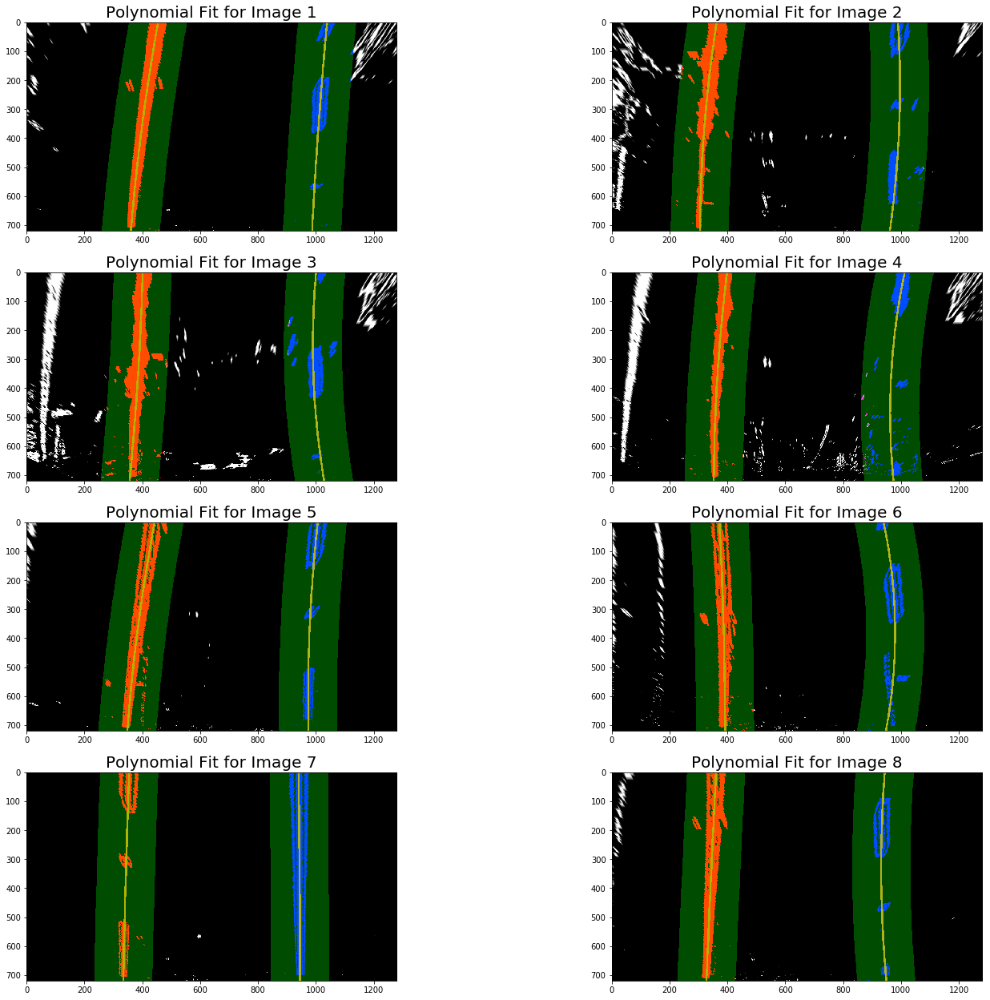

## Advanced Lane Finding Project

The goals for this project are:

- Compute the camera calibration matrix and distortion coefficients given a set of chessboard images.
- Undistort the raw images.
- Create a thresholded binary image using data from different colorspaces, gradient data, etc.
- Apply a perspective transform to get a bird's eye view of the image.
- Find the lane pixels and use polynomial fit to get the lane boundary.
- Determine the lane curvature and position of the car from the center.
- Unwarp the image back to the original perspective.
- Output visual display of the lane boundaries and numerical estimation of lane curvature and vehicle position.

This is the writeup for the Advanced Lane Lines project based on the notebook [Advanced_LaneLines.ipynb](./Advanced_LaneFinding.ipynb). The code for each section is in this notebook under the same heading.

### 1. Camera Calibration
For the camera calibration pipeline, I used the set of 20 checkerboard images with 9x6 corners provided by the Udacity team. The object points, i.e., the checkerboard corners are assumed to be in on the same Z-plane and seperatedby 1 unit in X and Y direction. So the coordinates are (x, y, 0). I used the `cv2.findChessboardCorners()` to update the `objpoints` and `imgpoints` and then passed themto `cv2.calibrateCamera()` function to obtain the camera matrix and distortion parameters. Then, used these parameters to pass to `cv2.unditort()` function to undistort the images.

The example of input checkerboard and undistorted image is shown below:


Next, moving on to creating a pipeline for the actual images on which we need to process.

### 2. Single Image Pipeline

For a single image pipeline, the following steps are implemented sequentially.

- Undistort the raw images.
- Create a thresholded binary image using data from different colorspaces, gradient data, etc.
- Apply a perspective transform to get a bird's eye view of the image.
- Find the lane pixels and use polynomial fit to get the lane boundary.
- Determine the lane curvature and position of the car from the center.
- Draw the lane information and unwarp the image back to the original perspective.

For the sake of satisfaction, each processing step is applied to all the test images as they represent different situations.

The following are the samples of the 8 images on which the pipeline is tested and the parameters are tuned.


#### 2.1 Example of distortion corrected road image.

To undistort the images is one simple call to the cv2.undistort() using the camera parameters obtained in Section 1. All the test files are then undistorted as seen below.


In the next step, these images are passed theough a thresholding pipeline to obtain robust edges.

### 2.2 Create a thresholded binary image using data from different colorspaces, gradient data, etc.

Here, after some exploration of different colorspace, the binary image is formed by fusing the magintude of gradient and thresholding the S and V channels of HSV colorspace. The result of this pipeline on undistorted test images is as below.


The thresholded images are pretty good. There are some unwanted patches but they can be filtered out by creating a mask in the next section.

### 2.3 Apply a perspective transform to get a bird's eye view of the image.

This step is necessary to validate that the lane lines are parallel. In this step, the perspective transform is applied to the thresholded images so that it gives a bird's eye view of the lane lines. This will be helpful in determining the radius of curvature and position of the car center from the offset. For this, the four points in the original perspective are selected to be transformed to a corresponding locations so that the lines look parallel. These points are given as.


```python
# Choose the points in the original image perspective by visual inspection
src = np.float32([(200, 720),      # bottom left
                  (542, 480),      # top left
                  (742, 480),      # top right
                  (1127, 720)])    # bottom right

# destination points in the same sequence
dst = np.float32([(320, 720),
                  (320, 0),
                  (960, 0),
                  (960, 720)])
```

The red polygon with vertices corresponding to the source points is shown in the below images.


The new perspective is obtained by using two OopenCV functions `cv2.getPerspectiveTransform()` and `cv2.warpPerspective()`. The output is shown below.


After the perspectivetransform, the lane lines look almot parallel. Thus, this will be helpful in finding the polynomial fit perfectly.

#### 2.4 Find the lane pixels and use polynomial fit to get the lane boundary.

For this part of the pipeline, I will find the histogram of the pixels located on the bottom half of the binary image. Once, the peakes, which also represent lane line positions, are obtained, a sliding window is applied around the peak position to find the polynomial fit to get the lane line equation parameters. The output of this step on the images obtained in the perspective transform step is shown below.


Now, assuming that the sliding window provides the valid parameters, for the next image, a simpler search in the neighborhood of the previously fit values was helpful to determine the lane line parameters. The output of this step on the same set of images is shown below.




#### 2.5 Determine the lane curvature and position of the car from the center.

To determine the radius of curvature of the lane and the offset from the center, the pixel space values are converted to meters by using the information of the width of the lane width and distance between the two lines. 

Then to obtain the radius of curvature, the polynomial fit coeffecients are applied at the midpoint of the height. This is done for both the left and right lines and then averaged.

To obtained the offset, the midpoint is found from the polynomial fit points in X direction and then the actual midpoint in X direction is subtracted.

#### 2.6 Draw the lane information and unwarp the image back to the original perspective.

Once the lane information is produced, everything canbe put together in the original image to display the results for verification. For this step, the region between the lane lines is filled with green and transformed bck to the original perspective by using the `cv2.warpPerspective()` function. However, for calculation of perspective transform, the order of soure and destination points is reversed. Also, the radius of curvature (in meter) and offset from center in left or right direction (in centimeter) is displayed on the test images.


Looks very good! Now, the last part is to put it all together. For this, I have decided to use a class called Lane(). This will keep track of all the previous lane lines results and use them in case the parameters obtained in the current frame are not useful. I have also added the calculation of radius of curvature and position from center inside this class and they will be updated every 10 frames.

### 3. Video Pipeline

For the processing of the video, a `Line()` class is used to keep track of the best polynomial fits and corresponding points so that if the lane lines in the current frame are not parallel, then the best values are used instead. To check if the lines are parallel, the difference in the distance between the top and bottom of the lines is used. If that is more than 100 pixels, then the lines are deemed as not parallel. Moreover, if the lines are not parallel in the 5 consequitive frames, the lane line finding pipeine will reset to the window search for polynomial fit. The final video produced for the test video is available [here](./project_video_output.mp4).

---

### Discussion


In this pipeline, the most challenging part was to come up with appropriate thresholds to generate a binary image in different lighting and road conditions. However, this was achieved by exploring different threshold in different colorspaces and the gradient image. But this is still not very effective measure because I could see the pipeline failing easily in the first challenge video. One of the possile solutions to this problem is to mask the regions with lane lines so that there is very little spurious data. 

The second difficult part was to come up with a better processing function to keep track of the lane lines. For this, I used the class to keep track of the previous 10 frames and the average of those values in order to calculate the radius of curvature and offset from the center.

Overall, this approach might fail to generalize and a more data intensive approach leveraging Deep/Machine Learning could be used.
